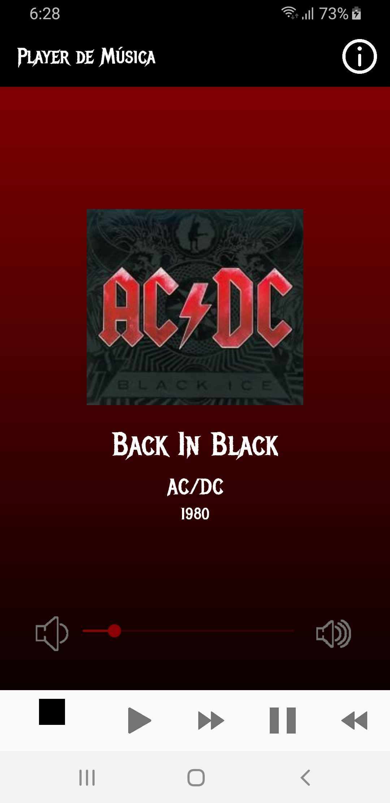
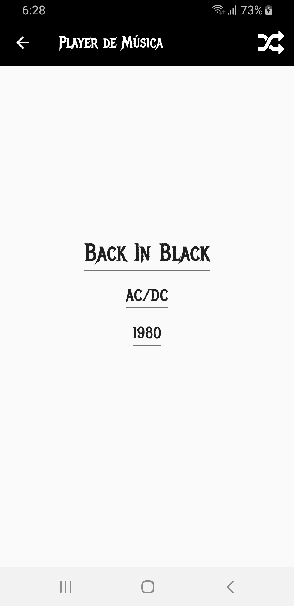

# Exemplo player de música
Um exemplo de um simples aplicativo player de música para Android.

## APK Versão Mínima
Android 4.4 KitKat

## Uso de seguintes recursos
* Biblioteca Media Player 
* Biblioteca Audio Manager para gerenciar o volume
* Array para apresentação de músicas, capa, autor e título
* Uso de gradient no background do aplicativo
* Botão para uma Activity com mais informações a respeito da música
* Uso de fonte personalizada
* Alterar valores e enviar através de uma Intent

### License
This repository is available under the [Mozilla Public License, version 2.0](https://github.com/jhonatasrm/exemplo-player-de-musica/blob/master/LICENSE)
